# Fish AI for *The Lakelings*

**Gameplay / AI Programmer · Derailed Arts · February – June 2025 · Unity, C#**

I was responsible for one thing at Derailed Arts, end to end: **the fish**. From an empty Unity
project to a playable demo shown at Develop Brighton — movement, senses, decision-making,
population control, and 3D underwater navigation.

It was my first professional games role and my first credit on a game.

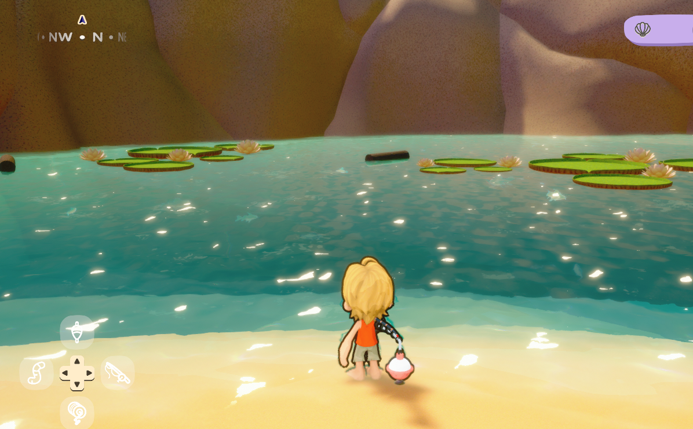

---

## At a glance

| | |
|---|---|
| **Studio** | Derailed Arts — founded by Joseph Cunningham (previously Senior Game Designer, nDreams) |
| **Game** | *The Lakelings* — a cosy multiplayer fishing game |
| **Role** | Gameplay / AI Programmer (paid, ~5 months) |
| **Team** | Founder/designer, two programmers, a technical producer, plus an AI advisor and contract artists |
| **Stack** | Unity, C#, GitHub (feature branches → `dev`), Miro as the living design doc, Discord |
| **Outcome** | Playable prototype demoed at **Develop Brighton** and **Brilliant Indie Treasures** |
| **Owned** | All fish behaviour in the wild — movement, sensing, AI, population, navigation |

---

## The game

*The Lakelings* is a cosy fishing game where you catch fish, sell them, upgrade your gear, and
unlock more of the lake. Its hook is what happens to the ones that get away: released or escaped
fish evolve into **Nemefish** — rarer, harder to catch, and able to *talk*. A language model
generates each Nemefish's personality from its history with the player, issues quests in character,
and lets them swim to other players' lakes carrying stories of past encounters.

The prototype had to prove the atmosphere, the fishing loop, and a first version of the Nemefish
system — originally for a Barclays investor event, and after that was cancelled, for Develop
Brighton.

My job was to make the lake feel alive enough that catching something from it mattered.

---

## What "the fish" actually meant

Fish existed in two modes. **Hooked** — the arcade fishing minigame — belonged to Josh, the other
programmer. **Free** — everything a fish does when nobody is holding a rod at it — was mine.

That split covers more than it sounds like:

- how a fish *moves*, and how two breeds move differently
- how it perceives bait, other fish, and terrain
- what it decides to do, and why
- how many fish exist, of what kind, and where
- how it crosses a lake without swimming through a sandbank

---

## Movement: translating theatre direction into physics

Joseph came from theatre production, and he handed me a design vocabulary rather than a spec:
**Laban Efforts**, a system actors use to physicalise character. He wanted fish whose personality
was legible purely from how they moved.

Three efforts, two states each:

| Effort | States | What I mapped it to |
|---|---|---|
| **Direction** | Direct / Indirect | straight line to target, or a slaloming path |
| **Weight** | Light / Strong | acceleration |
| **Speed** | Quick / Sustained | velocity |

Eight combinations, eight distinct movement personalities — before any per-fish tuning. On top of
that sits a **variance percentage** that nudges each individual's values off its breed baseline, so
fish of the same breed are recognisably related without being clones.

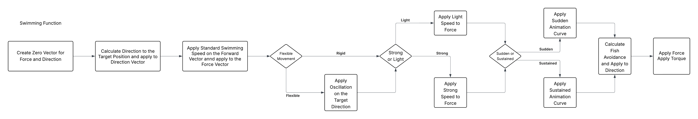

Mechanically it is deliberately simple: each fish is a Rigidbody that can only push itself
**forward**. Turning is rotation applied to the body, not a change of velocity. Each frame the
movement function accumulates a force vector from the active behaviour, adds an avoidance vector
averaged from nearby fish, then commits it through `AddForce`, with orientation applied via
`AddTorque`.

**There are no animations.** Every behaviour — surface feeding, resting, jumping, circling — is
physics and rotation only. Surface feeding turns the fish toward a random point near the waterline,
accelerates it gently upward, then fires a force *backwards* the moment it arrives, so it reads as
a fish snapping at an insect and darting away. Watching it move, you assume an animator was
involved. There wasn't one.

Behaviours run as coroutines, one at a time per fish, each signalling completion so the main loop
can assign the next target.

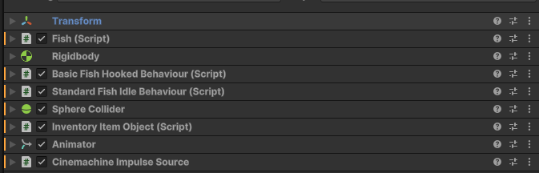

Per-breed values live in **ScriptableObject configuration files**, so tuning a breed's personality
was a designer task, not a code change.

---

## Senses: the Scanner

Fish needed to notice things. The Scanner runs on a configurable frame interval rather than every
frame, and does three jobs in one pass:

1. **Sphere cast for the bobber**, then checks whether it carries the correct bait. Correct bait
   makes the fish a candidate for the *Attracted to Bobber* state; wrong bait usually makes it flee,
   but with a small chance of interest anyway, so the player can still get lucky.
2. **Rebuilds the list of nearby fish**, which feeds the avoidance vector in the movement function.
3. **Ray casts forward** to detect terrain. A hit means the fish is heading into geometry, so it
   resets state, takes a new target, and requests a new path.

That third one is a fail-safe. Autonomous agents in a closed volume will eventually find a way to
wedge themselves into something; the ray cast means they always get themselves back out.

---

## Decision-making: a utility layer over a state machine

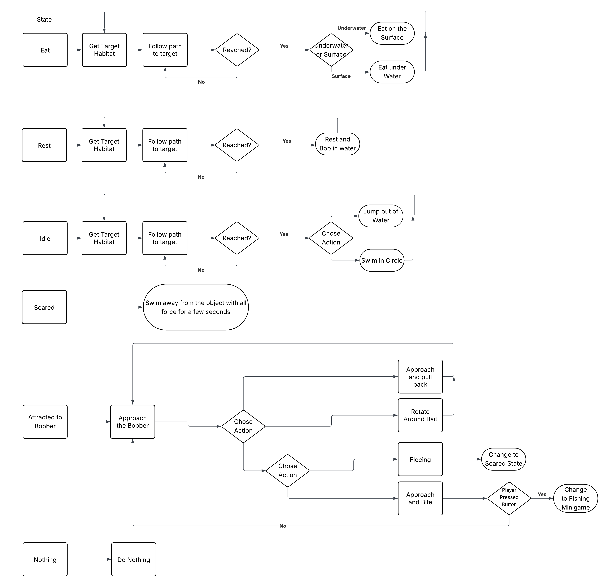

**The lower layer** is a finite state machine — *Eat*, *Rest*, *Attracted to Bobber*, *Idle*. Every
state follows the same shape: take a target, swim to it, perform an action on arrival. Idle jumps
out of the water or swims a circle. Rest goes to a nest habitat and bobs gently. Eat runs surface
or underwater feeding depending on context.

**The upper layer** is **Utility AI** with four needs — *Hunger*, *Energy*, *Idle*, *Fear*. Hunger
climbs over time. Energy drains with movement, scaled by speed. Fear accumulates near larger fish
until the fish flees. Idle wins when nothing else is pressing. Each tick, the dominant utility sets
the FSM state, and the actions the fish performs feed back into those values.

It is a small system, and that is the point: four floats and a selection function produce a lake
where fish are eating, resting, wandering and fleeing at different times for legible reasons,
without any of it being scripted.

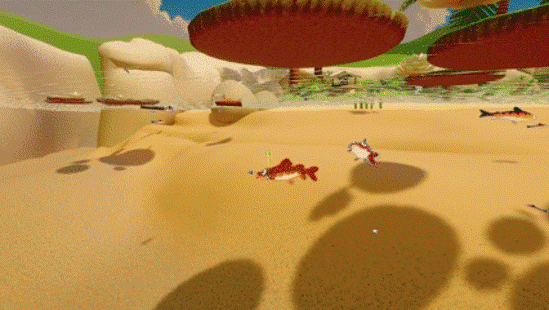

---

## Population management

Designers needed to be able to say "this lake has this many of that fish" and have it be true.

The system is two-tier. Each **waterbody** tracks its own fish counts and holds references to its
habitats — fish query it for habitat positions when they change state. A **population manager**
sits above all waterbodies, owns the spawn and despawn logic, checks counts every few frames, and
issues spawn orders wherever a lake is under target.

Designers set exact targets per **breed-and-size combination**, per lake. Adding a second lake meant
attaching the waterbody script and registering it — no changes to the manager.

The manager also carries a **"fish always bite" toggle**, which existed purely so Josh could iterate
on the fishing minigame without waiting for a fish to become interested. Small tools like that
turned out to matter more to the team's pace than anything elegant I wrote.

---

## The hard part: navigating a lake in three dimensions

Everything above worked, and the fish still swam into the beach.

The test level had a curved shoreline with habitats on opposite sides. Fish taking the direct route
ploughed into the sandbank — or out of the water entirely. Unity's NavMesh solves walking across a
surface; fish move through a *volume*.

### Voxel grid

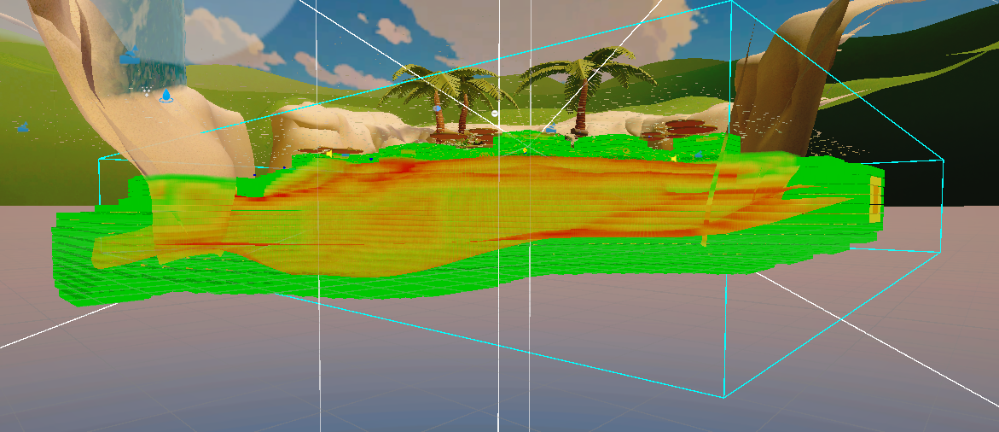

I voxelised the water. A generator script builds the grid **in the editor**, writes it into a
**ScriptableObject**, and is then disabled at runtime — so play mode reads precomputed data and pays
no build cost. Each voxel stores a position, an occupied flag, and a cost.

The grid is anchored to the water body: it begins at the surface and extends downward, which makes
"inside the grid" and "inside the water" the same statement. A whole category of out-of-bounds bugs
simply never existed.

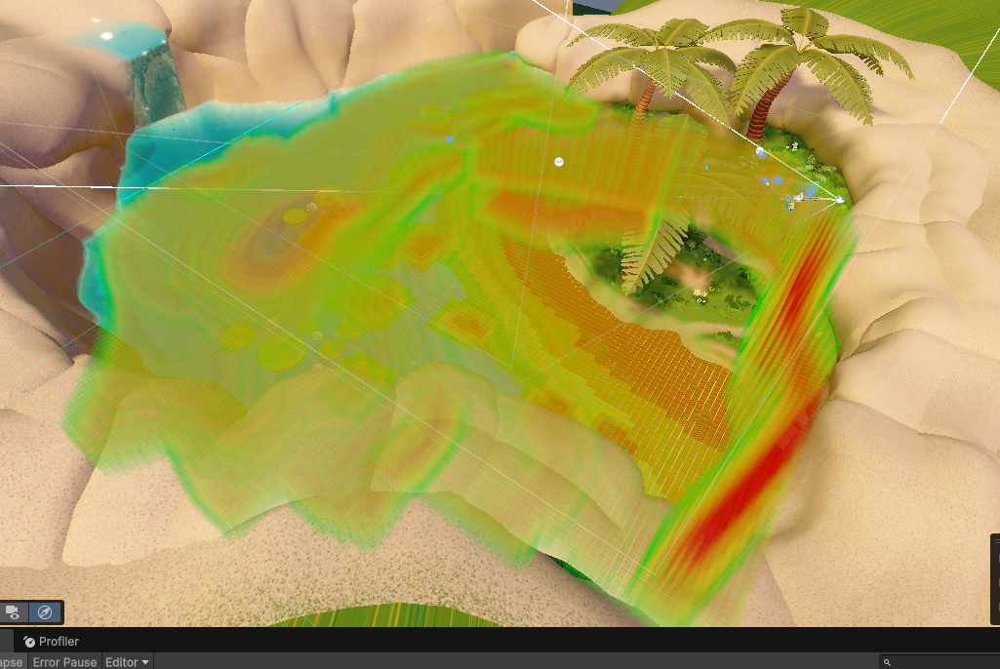

Cost is not binary. Voxels within three cells of an occupied one carry graded weight, so paths bend
away from terrain rather than scraping along it.

**Then the fish started surfacing.** The water surface was almost entirely unoccupied, so it was the
cheapest region in the grid — and A\* correctly routed fish *up to the top*, across, and back down.
Technically optimal, visually absurd. The fix was a deliberate extra penalty on the top row of
voxels, so fish stay submerged unless their target habitat is genuinely at the surface.

That is my favourite bug from the project, because the pathfinder was never wrong. The cost function
just did not yet encode "fish look stupid at the surface."

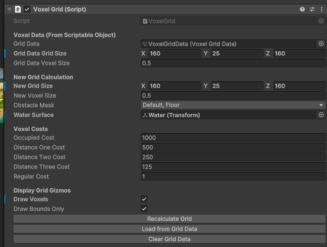

The generator is exposed with in-editor visualisation and custom inspector controls — it was going
to be tuned by people who were not me.

### A\*

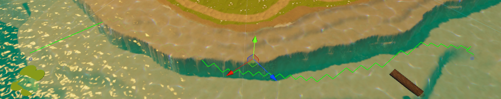

The first working version came together quickly and destroyed the framerate. With a full population
requesting paths, the game hit **one to two frames per second**.

What fixed it:

- **Converted the search into a coroutine** with a cap on steps per frame, so a path spreads across
  frames instead of blocking one
- **Step limiter with abandon-and-retry** — a search that grows too expensive is dropped and
  reattempted later from a new start position, rather than being allowed to stall the frame
- **One instance at a time**, so path requests serialise instead of stampeding
- **Swim while computing** — a fish heads toward its target's general direction and adopts the real
  path once it arrives, making the wait invisible
- **Tightened data types** through the hot loop
- **A toggleable debug layer** reporting success/failure and calculation time per path

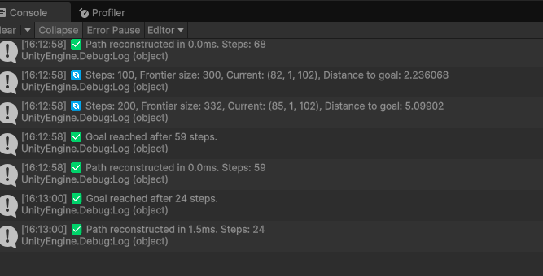

Paths are also **smoothed at follow time**: fish steer toward a node several ahead rather than
tracking node to node, which removes the robotic corner-turning that grid pathing produces.

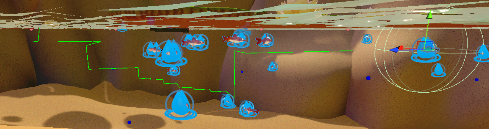

**On the AI assistance:** I wrote the first A\* implementation myself, and it was too slow. With the
deadline closing, Joseph asked me to use ChatGPT to work through the optimisation. That stung my
pride at the time, and it was the right call — he had paid for two developers and a deadline, not
for my ego. I still had to work out which optimisations applied, implement them into an existing
system, and verify each one; I can explain every change in that list and why it worked. The lesson I
actually took was about proportion: my discomfort was worth less than the demo.

### Fish avoiding each other

The fish already sensed their neighbours, so collision avoidance borrowed from **Boids** — an
avoidance vector averaged across nearby fish, folded into the movement force.

The first attempt failed in an interesting way: at high population, fish **settled into a static
lattice**, each perfectly avoiding its neighbours and none making progress. Mutual avoidance had
found an equilibrium. I weakened the avoidance strength and added **size filtering** — fish only
avoid individuals *larger* than themselves — which broke the symmetry and got the lake moving again.

Schooling behaviour was designed but cut at feature lock.

---

## What went wrong

**My first two weeks were thrown away.** I built a `CharacterController`-based fish; Josh had
independently built a physics-based one that was better and already integrated with his gameplay.
Mine did not fit his systems. We binned it, I adopted his base, and we split responsibilities
explicitly — free behaviour to me, hooked behaviour to him — with weekly meetings to keep it that
way. Losing two weeks to unclear ownership in a four-person team taught me to establish interfaces
before writing anything.

**I could not land Behaviour Designer Pro.** On advice from our AI consultant I prototyped the
behaviour-tree package, and it went well in isolation. Back-porting it into an established codebase
was the problem: full integration needed Josh to restructure significant parts of his code, and he
was out of time. I laid out three options for Joseph — full integration, a hybrid, or drop it — and
recommended against the hybrid, because the mess would outlive the demo. We dropped it. The lesson
is not about the package; it is that a foundational architecture choice has to be made early or not
at all.

**I shipped one very large script.** All fish behaviour lived in a single well-commented,
region-organised file that was still genuinely hard to navigate. What I would build instead:
ScriptableObject behaviours held in per-state lists and selected at runtime — a smaller core, and a
drag-and-drop overview of available behaviours for designers.

---

## How we worked

No formal QA — we tested each other's systems. I would fish while testing my own fish; Josh would
harass the wildlife while testing his rod. Joseph reviewed weekly and gave detailed feedback, and
several systems went through multiple rounds because of it: the population manager went from
breeds-with-random-sizes, to controlled sizes, to exact breed-and-size targets.

Git with per-developer branches merged into `dev`. A Miro board served as the living design document
and status tracker — which worked, and also taught me that documentation rots when nobody prunes it.

The hardest part was not technical. I worked remotely, alone, on my first professional project, and
spent a fair share of it convinced I was the weakest person in the room. The weekly-meeting cadence
was what helped: reporting progress out loud made it much harder to quietly spiral.

---

## Outcome

The prototype shipped and was demoed at **Develop Brighton** and **Brilliant Indie Treasures** — a
lake of two fish breeds moving with distinguishable personalities, making autonomous decisions,
navigating around terrain, reacting to bait, and fleeing from bigger fish.

Standing in a room watching strangers fish in something I had spent five months on removed any
remaining doubt about the career.

---

## What I would take into the next role

- Establish system boundaries and interfaces **before** writing code, especially on a small team
- Profile earlier — the A\* collapse would have been far cheaper to fix before it was load-bearing
- Foundational tooling decisions belong at the start of a project, or nowhere
- Build the designer-facing switch even when it is ugly; on a deadline, velocity beats elegance
- A cost function encodes intent, not just distance

---

*Written from my internship report submitted to Goldsmiths, University of London (MSc Computer Games
Programming). No code is shown or shared, under NDA. Screenshots are from builds publicly
demonstrated by the studio.*
